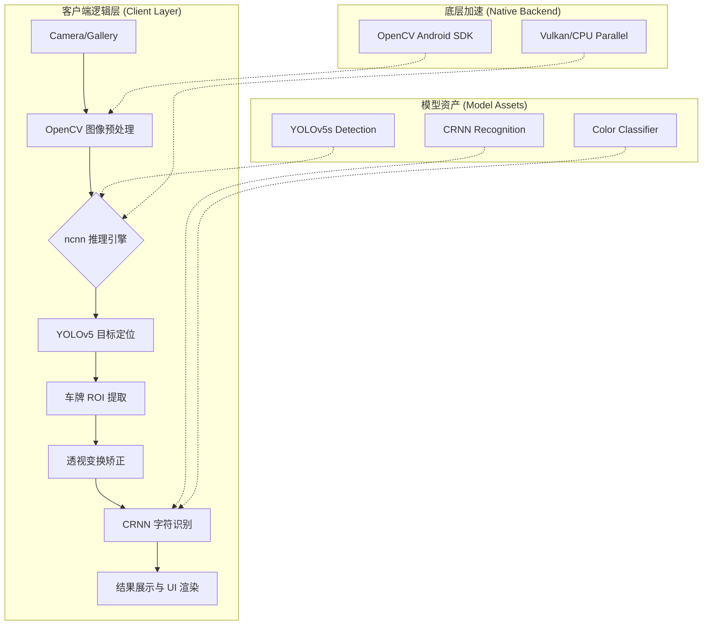

# 🚗 YOLO-Vehicle-Android

[](LICENSE)
[]()
[]()
[]()
[]()

> **Android 端高性能实时车辆检测与多维特征识别系统**

本项目是一个基于 **ncnn** 推理引擎与 **YOLOv5** 架构的移动端视觉方案。它集成了实时车辆目标检测、全颜色车牌识别、特殊车辆监控以及多种传感器数据对接。通过底层 C++ 优化与 OpenCV Native 加速，实现了在 Android 端侧的高帧率、低延迟离线推理。

🌍 [English](./README_EN.md) | 🇨🇳 [简体中文](./README.md)

---

## 📸 效果演示 (Screenshots)

| |  |  |
|:---:|:---:|:---:|
| 实时目标检测 | 车牌提取与矫正 | 夜间/复杂场景识别 |

---

## 🚀 核心特性 (Features)

- **🚗 实时目标检测**：基于 YOLOv5 深度优化的移动端模型，实时准确识别多种车型。
- **🎯 全颜色车牌识别**：支持蓝、黄、绿、白、黑五种颜色车牌的精准定位与 CRNN 字符识别。
- **🔄 自动透视矫正**：针对倾斜或非正视角度拍摄的车牌，利用 OpenCV 进行透视变换（Perspective Transform）自动矫正。
- **⚠️ 特殊目标监控**：针对危险品运输车辆等特定交通目标进行实时预警。
- **⚡ 端侧推理加速**：采用腾讯 ncnn 框架，利用 Vulkan 充分榨取移动端 CPU/GPU 算力，**完全断网可用**。
- **🏷️ 多模态数据对接**：内置集成二维码/条码扫码识别以及 RFID 射频标签读取支持。

---

## 🏗️ 系统架构 (Architecture)



## 🛠️ 技术栈 (Tech Stack)

| 层级 | 技术方案 |
| :--- | :--- |
| **应用框架** | Android Native (Java/JNI) |
| **AI 推理引擎** | [ncnn](https://github.com/Tencent/ncnn) (Tencent) |
| **目标检测模型** | YOLOv5 |
| **文字识别模型** | CRNN + CTC |
| **图像处理** | OpenCV Android SDK |
| **构建工具** | Gradle + CMake |

## 📋 环境要求 (Requirements)

- Android Studio Arctic Fox (或更高版本)
- Android NDK `24.0.8215888`
- CMake `3.10.2+`
- Android SDK API Level `28+`

## 🚦 快速开始 (Quick Start)

### 1. 克隆项目
```bash
git clone [https://github.com/TooBeyond/YOLO-Vehicle-Android.git](https://github.com/TooBeyond/YOLO-Vehicle-Android.git)
cd YOLO-Vehicle-Android
```

### 2. 配置环境
在根目录的 `local.properties` 文件中配置您的 SDK 和 NDK 路径：
```properties
ndk.dir=/path/to/your/ndk/24.0.8215888
sdk.dir=/path/to/your/android-sdk
```

### 3. 编译与运行
您可以直接在 Android Studio 中点击 `Run`，或使用命令行编译：
```bash
./gradlew assembleDebug
```
> 生成的 APK 将保存在 `app/build/outputs/apk/debug/` 目录下。

---

## 📁 项目结构 (Directory Structure)

```text
YOLO-Vehicle-Android/
├── app/
│   ├── src/main/
│   │   ├── java/com/tencent/yolov5ncnn/
│   │   │   ├── MainActivity.java      # 核心 UI 交互
│   │   │   ├── PlateRecognition.java  # 车牌识别业务逻辑
│   │   │   ├── YoloV5Ncnn.java        # YOLO JNI 接口层
│   │   │   ├── library/               # 识别算法库封装
│   │   │   └── AlgorithmUtil/         # 算法工具类
│   │   ├── assets/                    # 🚀 AI 模型存放区
│   │   │   ├── best.bin               # 检测模型权重
│   │   │   ├── crnn.bin               # OCR 识别模型
│   │   │   └── plate_rec_color.bin    # 颜色分类模型
│   │   ├── res/                       # Android 资源文件
│   │   └── jni/                       # ⚙️ C++ 底层实现与 OpenCV 交互
│   └── build.gradle
├── sdk/                               # 独立的 SDK 封装模块
├── gradle/                            # Gradle 构建配置
└── README.md
```

## 📊 模型规格与性能 (Performance)

| 模型文件 | 文件大小 | 核心用途 |
| :--- | :--- | :--- |
| `best.bin` | 6.6 MB | 车辆及车牌位置检测 |
| `crnn.bin` | 7.4 MB | 车牌字符提取与识别 |
| `plate_rec_color.bin`| 2.6 MB | 车牌底色识别分类 |

- **推理速度**：约 `30ms/帧` (基于 Snapdragon 865 测试)
- **综合识别率**：`> 95%` (在标准光照环境下)
- **最佳输入分辨率**：建议控制在 `1920x1080` 以下以兼顾速度与发热。

## 🤝 参与贡献 (Contributing)

发现 Bug 或有新的想法？非常欢迎提交 Issue 和 Pull Request！
1. Fork 本仓库
2. 创建您的特性分支 (`git checkout -b feature/AmazingFeature`)
3. 提交您的更改 (`git commit -m 'Add some AmazingFeature'`)
4. 推送到分支 (`git push origin feature/AmazingFeature`)
5. 开启一个 Pull Request

## 📄 开源协议 (License)

本项目基于 [MIT License](LICENSE) 协议开源。

---

**⭐️ 如果这个项目对您有帮助，请点亮右上角的 Star 支持一下，让更多人看到！**
