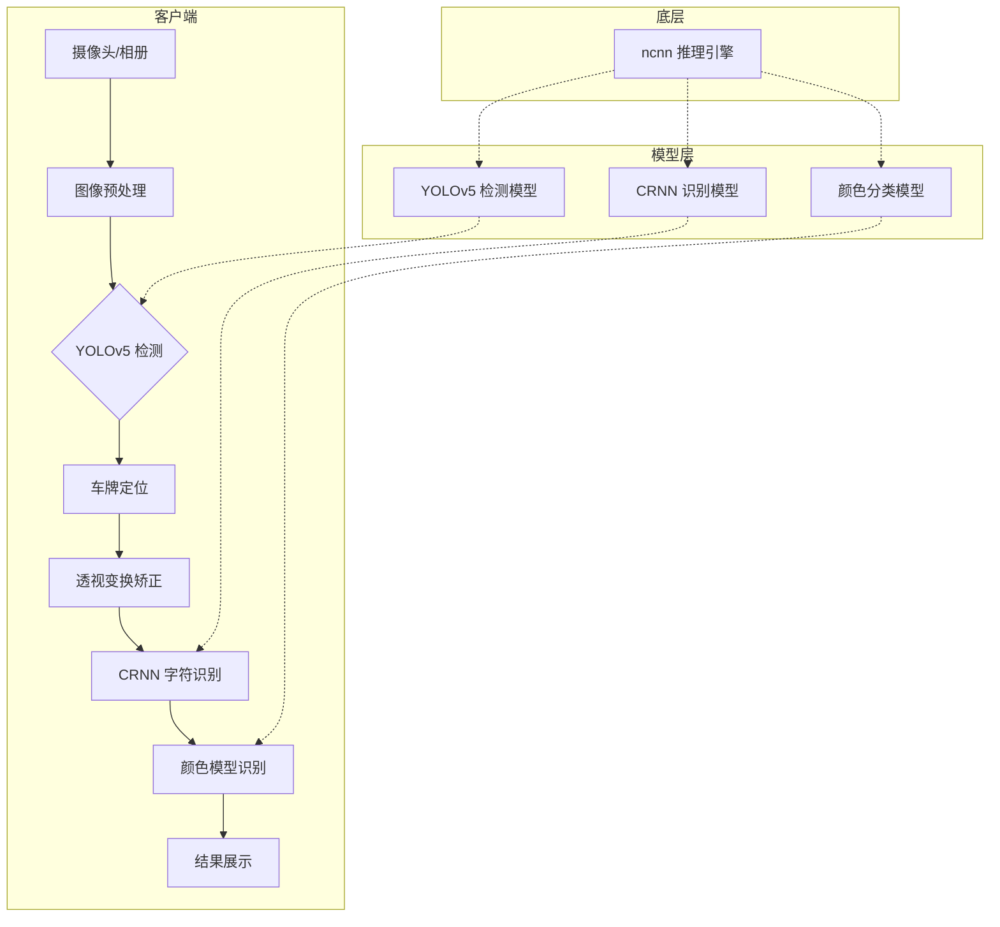

# YOLO-Vehicle-Android
[](LICENSE)
[]()
[]()
[]()
[]()

🏆 智慧交通赛项获奖作品 | Android 端车辆识别系统

基于 ncnn + YOLOv5 的 Android 实时车辆检测与车牌识别系统，支持多场景、多车型的智能识别。

[English](./README_EN.md) | [中文](./README.md)

## 🚀 特性

- 🎯 **车牌识别** - 支持蓝、黄、绿、白、黑五种颜色车牌
- 🚗 **车辆检测** - 实时检测多种车型
- ⚠️ **危险品车辆识别** - 智能识别危险品运输车辆
- 📱 **二维码/条码识别** - 支持多种格式
- 🏷️ **RFID 识别** - 射频识别支持
- ⚡ **实时推理** - 本地端侧推理，无需网络
- 🔄 **车牌矫正** - 透视变换矫正倾斜车牌

## 🏗️ 系统架构



## 🛠️ 技术栈

| 层级 | 技术 |
|------|------|
| **框架** | Android Native |
| **AI 推理** | ncnn (腾讯开源) |
| **检测模型** | YOLOv5 |
| **识别模型** | CRNN + CTC |
| **图像处理** | OpenCV Android |
| **构建工具** | Gradle + CMake |

## 📋 环境要求

- Android Studio Arctic Fox+
- NDK 24.0.8215888
- CMake 3.10.2+
- Android SDK 28+

## 🚦 快速开始

### 1. 克隆项目
```bash
git clone https://github.com/TooBeyond/YOLO-Vehicle-Android.git
cd YOLO-Vehicle-Android
```

### 2. 配置 NDK
在 `local.properties` 中配置：
```properties
ndk.dir=/path/to/ndk/24.0.8215888
sdk.dir=/path/to/android-sdk
```

### 3. 编译运行
```bash
./gradlew assembleDebug
```

### 4. 安装 APK
生成的 APK 位于 `app/build/outputs/apk/debug/`

## 📁 项目结构

```
YOLO-Vehicle-Android/
├── app/
│   ├── src/main/
│   │   ├── java/com/tencent/yolov5ncnn/
│   │   │   ├── MainActivity.java      # 主界面
│   │   │   ├── PlateRecognition.java  # 车牌识别入口
│   │   │   ├── YoloV5Ncnn.java         # YOLO 检测核心
│   │   │   ├── library/                # 识别算法库
│   │   │   └── AlgorithmUtil/          # 算法工具
│   │   ├── assets/                     # AI 模型文件
│   │   │   ├── best.bin                # 检测模型
│   │   │   ├── crnn.bin                # 识别模型
│   │   │   └── plate_rec_color.bin     # 颜色模型
│   │   ├── res/                        # 资源文件
│   │   └── jni/                        # JNI 底层实现
│   └── build.gradle
├── sdk/                    # SDK 封装
├── gradle/                 # Gradle 配置
└── README.md
```

## 📊 模型说明

| 模型 | 大小 | 用途 |
|------|------|------|
| `best.bin` | 6.6MB | 车牌/车辆检测 |
| `crnn.bin` | 7.4MB | 字符识别 |
| `plate_rec_color.bin` | 2.6MB | 颜色识别 |

## ⚡ 性能

- 检测速度：~30ms/帧 (骁龙 865)
- 识别准确率：>95%
- 支持分辨率：1920x1080 以下

## 🤝 贡献

欢迎提交 Issue 和 Pull Request！

## 📄 许可证

MIT License - 查看 [LICENSE](LICENSE) 详情

---

⭐ Star 支持一下，让更多人看到这个项目！